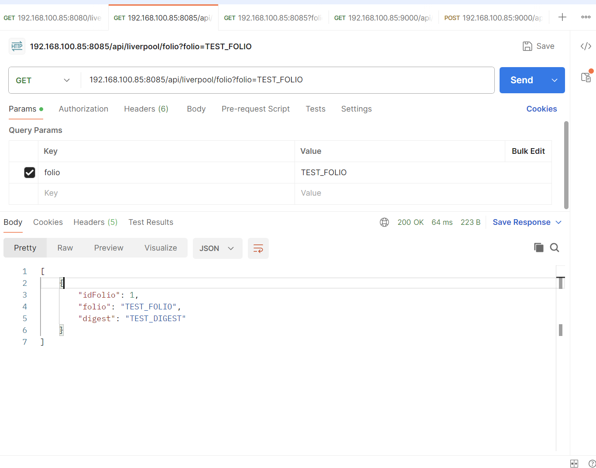
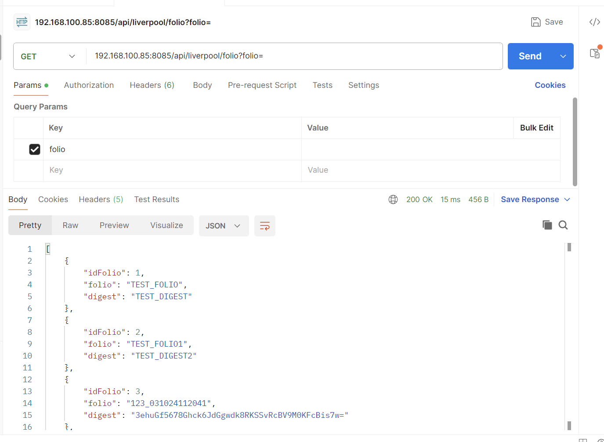

# LIVERPOOL CHALLENGE 

### for consume the micro service:

#### {ip}:{port}/api/liverpool/folio?folio=

- example the consume from end point in post pan

- if folio not exist show all folio

<small> &copy; 2024 José Luis Hernández Velázquez.</small>

